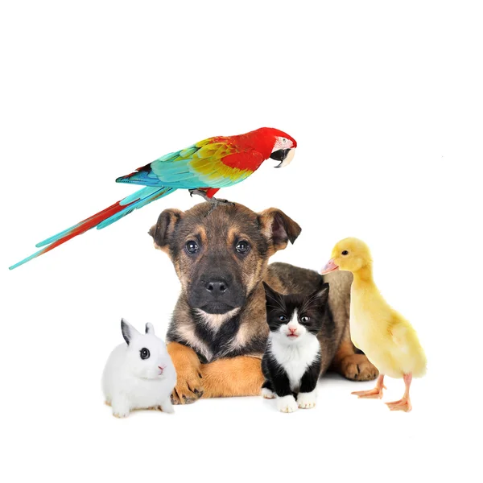

# **Classipet 🐾**

## 🌍 Choose Your Language / Elige tu idioma:
- [English](#english-)
- [Español](#español-)

---

## English 🇬🇧

**Classipet** is a web application developed with Streamlit that classifies pets into different categories (Dog 🐕, Cat 🐈, Rabbit 🐇) based on their physical characteristics. The user enters the pet's weight, height, eye color, and fur length, and the predictive model will tell them which class the pet belongs to.

You can try the app online by clicking the following link: [Classipet on Streamlit](https://mascotas.streamlit.app/) 🌐

## Requirements 📦

Make sure you have the following packages installed:

- `streamlit`
- `joblib`
- `pandas`
- `json`

You can install the necessary dependencies by running:

```bash
pip install streamlit joblib pandas
```

## Description 📝

The app provides a graphical interface in Streamlit where the user is asked to input the following data about their pet:

- **Weight** (kg)
- **Height** (cm)
- **Eye color** (Blue, Brown, Gray, Green)
- **Fur length** (Long, Medium, Short)

The trained model predicts which type of pet it is (Dog 🐕, Cat 🐈, Rabbit 🐇) based on these inputs.

---

## Español 🇪🇸

**Classipet** es una aplicación web desarrollada con Streamlit que clasifica las mascotas en diferentes categorías (Perro 🐕, Gato 🐈, Conejo 🐇) basándose en sus características físicas. El usuario ingresa el peso, altura, color de ojos y largo del pelo de su mascota, y el modelo predictivo le dirá a qué clase pertenece.

Puedes probar la aplicación en línea haciendo clic en el siguiente enlace: [Classipet en Streamlit](https://mascotas.streamlit.app/) 🌐

## Requisitos 📦

Asegúrate de tener instalados los siguientes paquetes:

- `streamlit`
- `joblib`
- `pandas`
- `json`

Puedes instalar las dependencias necesarias ejecutando:

```bash
pip install streamlit joblib pandas
````

## Descripción 📝

La aplicación cuenta con una interfaz gráfica en Streamlit donde se le solicita al usuario los siguientes datos sobre su mascota:

- **Peso** (kg)
- **Altura** (cm)
- **Color de ojos** (Azul, Marrón, Gris, Verde)
- **Largo del pelo** (Largo, Medio, Corto)

El modelo entrenado predice a qué tipo de mascota pertenece (Perro 🐕, Gato 🐈, Conejo 🐇) basándose en estos datos.


# Clasificador de Mascotas

Aplicación hecha en Streamlit que carga un modelo previamente entrenado y clasifica mascotas en función del peso, la altura, el color de ojos y el largo del pelo.

El enlace de la app en streamlit es https://mascotas.streamlit.app/




